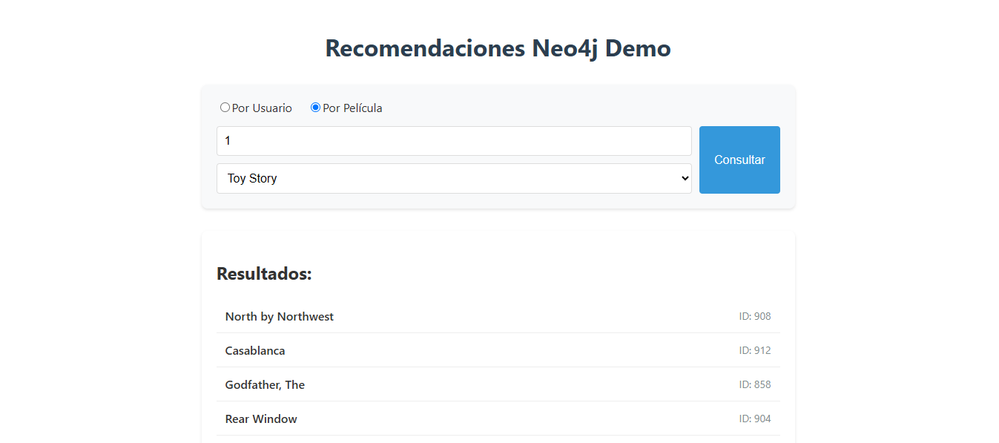
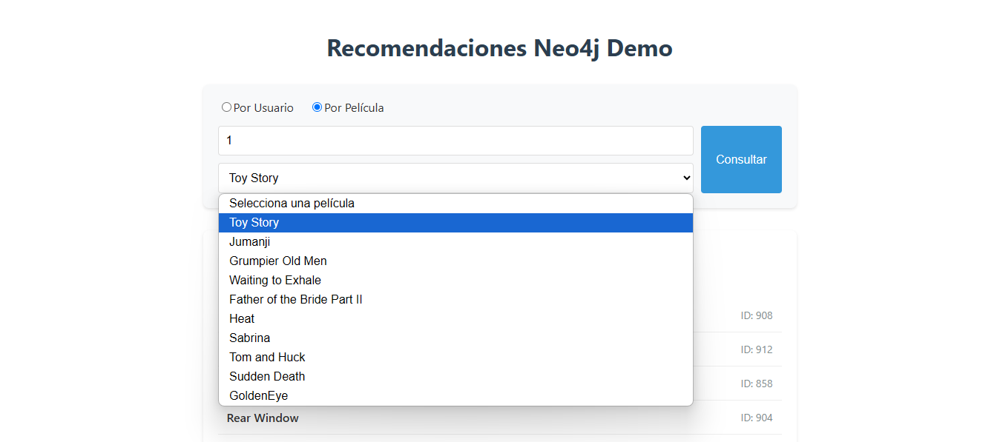

    - Disculpe Ing. pero en la carpeta de neo no se subio, ahi tiene el frontend, pero le deje capturas de pantalla de que si me funciono a la perfección, de igual forma no esta dificl de construir el proyecto.
### Nombre: *Dany Abimael Cabrera Hernández*
### Carne: *2890-22-1898*
### Curso: *Analisis de sistemas I*
### Tarea: *[S17] Neo4j - Recommendations*
- Link repositorio GitHub: https://github.com/DanyCabrera/NEO4J/tree/master

# Casos de Uso de Neo4j como Base de Datos de Grafos
# Conexión a Neo4j
- Neo4j es una base de datos orientada a grafos que permite modelar y consultar relaciones complejas de manera eficiente. Para conectarse a Neo4j, necesitas tener instalado Node.js y npm.

- para la conexión a Neo4j, use las siguientes credenciales, ya que Neo4j me lo proporciono: 
    - URL: bolt+s://demo.neo4jlabs.com:7473

    - Username: recommendations

    - Password: recommendations

    - Database name: recommendations
# Pruebas e instalaciones de dependecias
- Primero que nada, debes tener instalado Node.js y npm. Si no lo tienes, puedes instalarlo siguiendo estos pasos:
    - Descarga e instala Node.js desde https://nodejs.org/es/download/
    - Abre una terminal y ejecuta el siguiente comando para instalar npm:
        ```
        npm install -g npm
        ```
    - Ahora puedes instalar las dependencias necesarias para ejecutar el proyecto:
        ```
        npm install
        ```
- Y tener instalado python y pip. Si no lo tienes, puedes instalarlo siguiendo estos pasos:
    - Descarga e instala Python desde https://www.python.org/downloads/
    - Abre una terminal y ejecuta el siguiente comando para instalar pip:
        ```
        pip install flask flask-cors neo4j
        ```
        Esto instalará Flask, Flask-CORS y Neo4j. Luego crea un archivo app.py o cualquier otro nombre para el servidor Flask.
## Para la interfaz de usuario
- Abre una terminal y ejecuta el siguiente comando para instalar npm:
    ```
    npx create-react-app "nombre_de_alguna_carpeta"
    ```
    Luego entrar a esa carpeta y ejecutar el siguiente comando para instalar las dependencias necesarias para el proyecto:
    ```
    cd "nombre_de_su_carpeta"
    npm install
    ```
-   Esto le creara un carpeta con varios archivos pero el que mas nos interesa es la carpeta "src" que contiene el código fuente de nuestra aplicación.
-   Abre el archivo "App.js" en tu editor de código favorito.
    Para inicar el proyecto, ejecuta el siguiente comando en la terminal:
    - dentro de la carpeta "src":
    ```
    npm start 
    ```
    Esto iniciará el servidor de desarrollo en http://localhost:3000 y abrirá tu navegador.

    dentro de tu proyecto abre la terminal para ejecutar el servirdo app.py
    con el siguiente comando:
    ```
    python app.py
    ```
    Luego abre la aplicación en tu navegador y verás la interfaz de usuario.





# Escenarios donde Neo4j es más eficiente que una base de datos relacional tradicional

## Introducción
- Neo4j es una base de datos orientada a grafos que permite modelar y consultar relaciones complejas de manera eficiente. A continuación, se presentan tres escenarios reales donde Neo4j supera a las bases de datos relacionales tradicionales, junto con la justificación y ejemplos visuales.

## Escenario 1: Búsqueda de recomendaciones de películas
- En este escenario, se busca recomendaciones de películas para un usuario específico. La base de datos relacional tradicional podría ser una tabla de usuarios y una tabla de películas, con una relación de "recomendación" entre usuarios y películas. Sin embargo, en este caso, la base de datos relacional tradicional no es adecuada ya que no permite representar las relaciones complejas entre usuarios y películas.
- En lugar de una tabla de usuarios y una tabla de películas, se puede utilizar una base de datos orientada a grafos para representar las relaciones complejas entre usuarios y películas. En este caso, la base de datos Neo4j es más eficiente que la base de datos relacional tradicional debido a su capacidad para representar y consultar relaciones complejas de manera eficiente.
- En el escenario de búsqueda de recomendaciones de películas, se puede utilizar la consulta Cypher para realizar la búsqueda de recomendaciones de películas para un usuario específico. La consulta Cypher permite representar las relaciones complejas entre usuarios y películas de manera clara y eficiente.

# Redes Sociales y Recomendaciones de Amigos
## Descripción del escenario
- En una red social, los usuarios están conectados entre sí mediante relaciones de amistad, seguidores, intereses, etc. Un caso típico es sugerir “amigos de amigos” o encontrar comunidades.

## Justificación del uso de grafos
- Las relaciones entre usuarios pueden ser profundas y complejas (varios niveles de conexión).
- Consultas como “¿quiénes son los amigos de mis amigos que no son mis amigos?” requieren múltiples JOINs en SQL, lo que es ineficiente y difícil de escalar.
- En Neo4j, estas consultas son directas y rápidas gracias a la estructura de nodos y relaciones.

# Detección de Fraude en Finanzas
## Descripción del escenario
- En sistemas bancarios, es fundamental detectar patrones de fraude, como transferencias sospechosas entre cuentas, redes de lavado de dinero, o cuentas compartidas.

## Justificación del uso de grafos
- Los patrones de fraude suelen involucrar múltiples entidades y relaciones indirectas (por ejemplo, cuentas conectadas a través de intermediarios).
- En SQL, identificar estos patrones requiere consultas recursivas y JOINs complejos, que son lentos y difíciles de mantener.
- En Neo4j, puedes buscar patrones complejos de relaciones con consultas Cypher sencillas y eficientes.

# Conclusión
    - En todos estos casos, la estructura de grafos permite modelar y consultar relaciones complejas de manera natural, eficiente y escalable, superando ampliamente las limitaciones de los JOINs y la recursividad en bases de datos relacionales tradicionales.